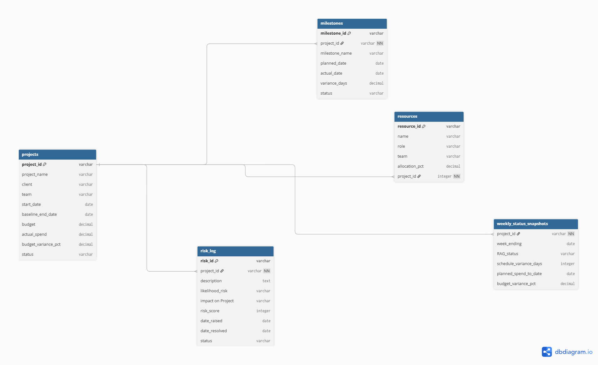
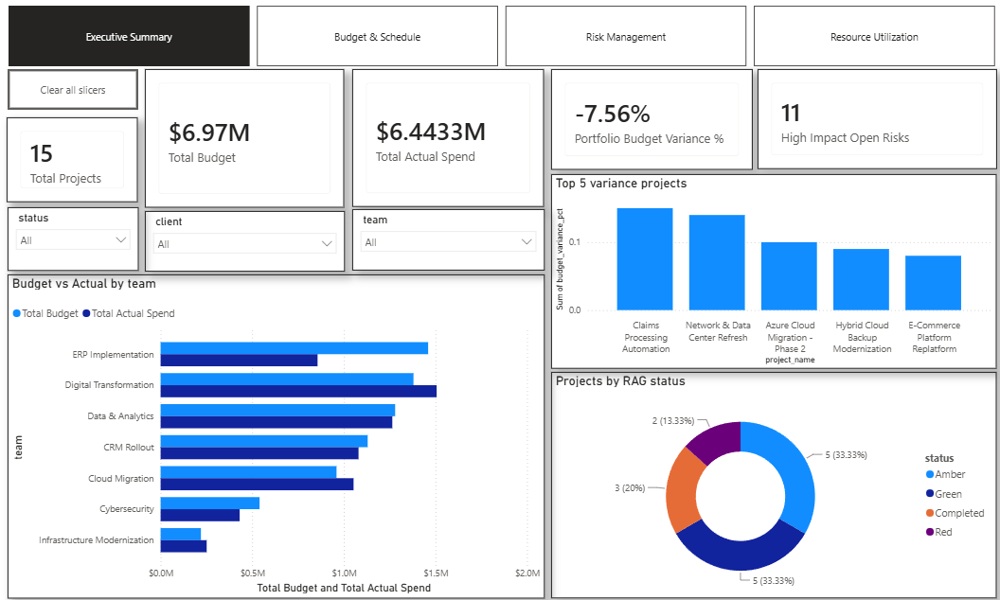

# Multi-Client PMO Portfolio Tracker

A PostgreSQL + Power BI portfolio project simulating multi-client IT services delivery — tracking budget, schedule, risk, and resource allocation across 15 concurrent projects.

**Built by Mayank Chonde** · [LinkedIn](https://www.linkedin.com/in/mayank-chonde-649610229/)

---

## Overview

This project simulates a Project Management Office (PMO) supporting a multi-client IT services delivery organization. It's an end-to-end data pipeline — from relational schema design through SQL analysis to an interactive executive dashboard — built on realistic, portfolio-scale synthetic data rather than a toy or single-table exercise.

**At a glance:**
- 15 concurrent projects across 10 clients and 7 delivery teams (ERP Implementation, Cloud Migration, Cybersecurity, Data & Analytics, Digital Transformation, CRM Rollout, Infrastructure Modernization)
- A 5-table relational schema (Projects, Milestones, Resources, RiskLog, WeeklyStatus) built in PostgreSQL
- 111 milestones, 68 resource allocations, 37 logged risks, and 150 weekly status snapshots
- A 10-query SQL showcase spanning beginner filtering through CTEs, window functions, and correlated subqueries
- A 4-page interactive Power BI dashboard with a full DAX measure library and drillthrough detail page

## Business Problem

An IT services PMO managing 15 concurrent client engagements across 7 delivery teams needs consolidated, real-time visibility into budget health, schedule adherence, risk exposure, and resource allocation. Without a centralized system, this visibility is typically assembled manually — a PMO Analyst compiling individual project statuses ahead of each Steering Committee meeting, a process that's slow, error-prone, and not repeatable on demand.

This project closes that gap with a governed, queryable data layer and a self-service reporting layer on top of it.

## Objectives

- Identify which projects are at risk of budget overrun or schedule slippage before a client or executive raises it
- Surface the portfolio's highest-severity open risks and track the risk backlog over time
- Detect resource over-allocation across simultaneous project assignments
- Provide an automated, rule-based escalation signal instead of relying on manual judgment calls
- Make all of the above self-service through an interactive dashboard, not a static report

---

## Tech Stack

| Tool | Role |
|---|---|
| **PostgreSQL** | Primary relational database |
| **DBeaver** | Database client for import, querying, and schema management |
| **Power BI Desktop** | Data model, DAX measures, and the interactive dashboard |
| **Excel** | Initial data staging and validation before CSV export and PostgreSQL import |

---

## Data Model

5 tables, all related through `project_id`:

| Table | Rows | Key Columns | Purpose |
|---|---|---|---|
| `projects` | 15 | `project_id` (PK), client, team, status | Central project record — one row per engagement |
| `milestones` | 111 | `milestone_id` (PK), `project_id` (FK) | Deliverable checkpoints per project |
| `resources` | 68 | `resource_id` (PK), `project_id` (FK) | People staffed to projects and their allocation % |
| `risklog` | 37 | `risk_id` (PK), `project_id` (FK) | Identified risks, likelihood/impact/score |
| `weeklystatus` | 150 | `project_id` (FK), `week_ending` | Weekly time-series of RAG status and spend |

**Key design decisions:**
- Client and team fields were denormalized directly onto `projects` and `resources` rather than split into separate lookup tables — a deliberate simplicity trade-off for a portfolio-scale dataset.
- All four child tables relate to `projects` with single-direction cross-filtering, keeping filter propagation predictable in the BI layer.
- `risk_score` is pre-computed from a standard likelihood × impact matrix (1–9 scale), keeping risk prioritization consistent across the SQL layer and the dashboard.



---

## SQL Highlights

The full 10-query set spans four difficulty tiers — filtering, joins, aggregation, CTEs, window functions, correlated subqueries, and business-rule logic. Full script: [`sql/queries.sql`](sql/queries.sql). Two examples:

**Top 3 riskiest projects per team** (CTE + window function):
```sql
WITH project_risk AS (
    SELECT p.project_id, p.project_name, p.team,
           SUM(r.risk_score) AS total_risk_score
    FROM projects p
    JOIN risklog r ON p.project_id = r.project_id
    WHERE r.risk_state = 'Open'
    GROUP BY p.project_id, p.project_name, p.team
),
ranked AS (
    SELECT *, RANK() OVER (PARTITION BY team ORDER BY total_risk_score DESC) AS risk_rank
    FROM project_risk
)
SELECT project_id, project_name, team, total_risk_score, risk_rank
FROM ranked
WHERE risk_rank <= 3
ORDER BY team, risk_rank;
```

**Automated escalation rule engine** (multi-table CASE logic):
```sql
SELECT
    p.project_id, p.project_name, p.status, p.budget_variance_pct,
    COALESCE(risk.high_open_risks, 0) AS high_open_risks,
    CASE
        WHEN p.status = 'Red' AND COALESCE(risk.high_open_risks, 0) > 0
            THEN 'Escalate to Executive Sponsor'
        WHEN p.status = 'Red' THEN 'Escalate to PMO Director'
        WHEN p.status = 'Amber' AND p.budget_variance_pct > 5
            THEN 'Flag for Steering Committee'
        WHEN p.status = 'Amber' THEN 'Monitor'
        ELSE 'No Action'
    END AS escalation_action
FROM projects p
LEFT JOIN (
    SELECT project_id, COUNT(*) AS high_open_risks
    FROM risklog
    WHERE risk_state = 'Open' AND impact = 'High'
    GROUP BY project_id
) risk ON p.project_id = risk.project_id
ORDER BY CASE p.status WHEN 'Red' THEN 1 WHEN 'Amber' THEN 2 ELSE 3 END;
```

---

## Dashboard Walkthrough

### Page 1 — Executive Summary


7 of 15 projects (47%) are currently Red or Amber, while the portfolio runs 7.56% under budget
